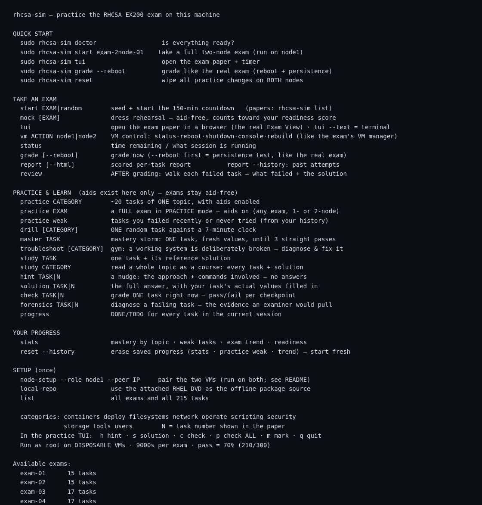
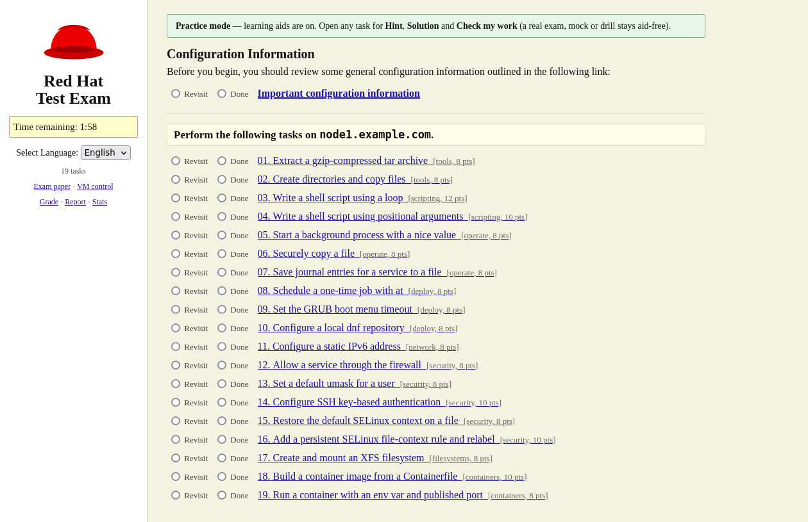
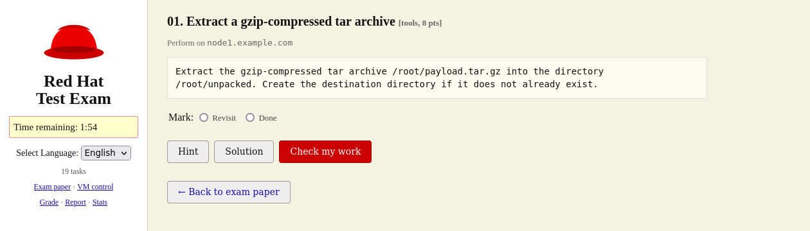
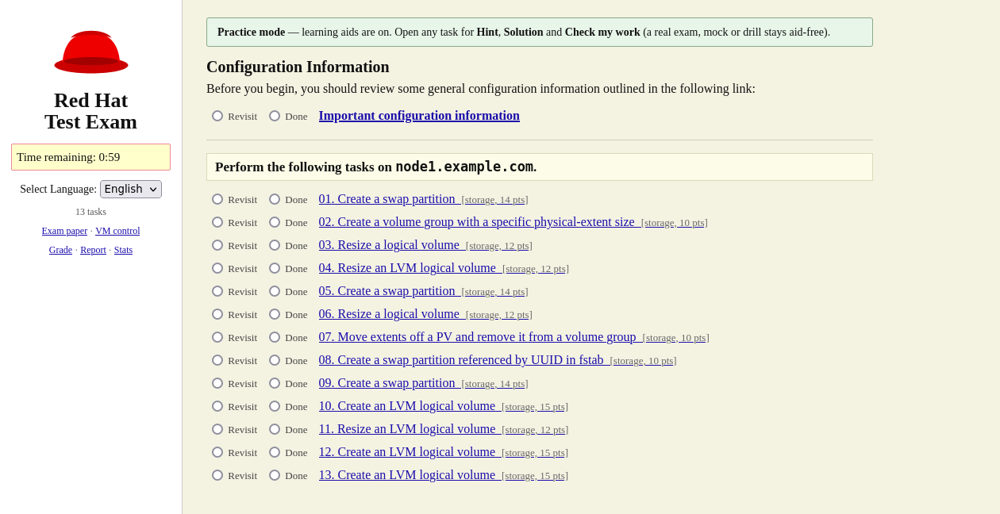
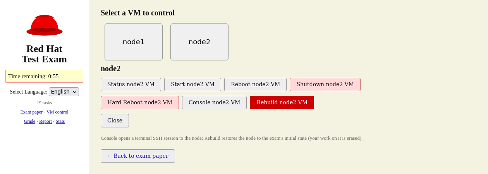
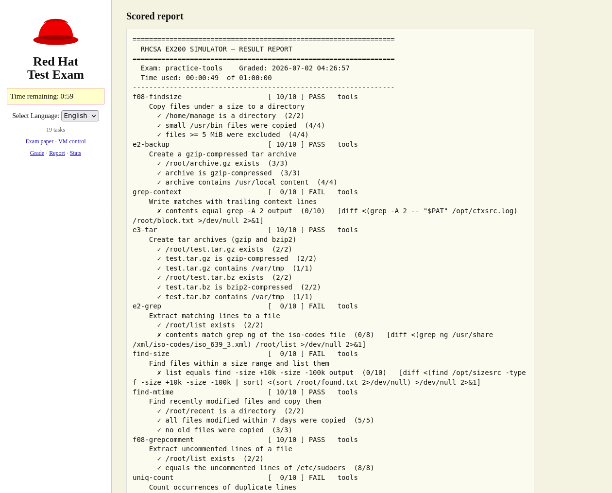
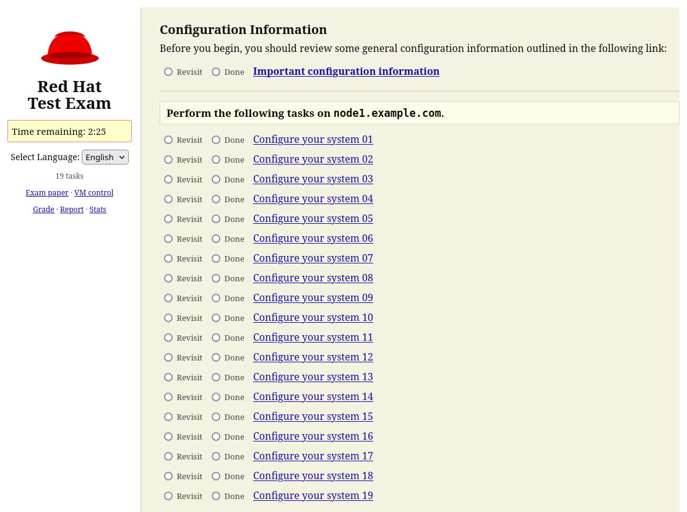
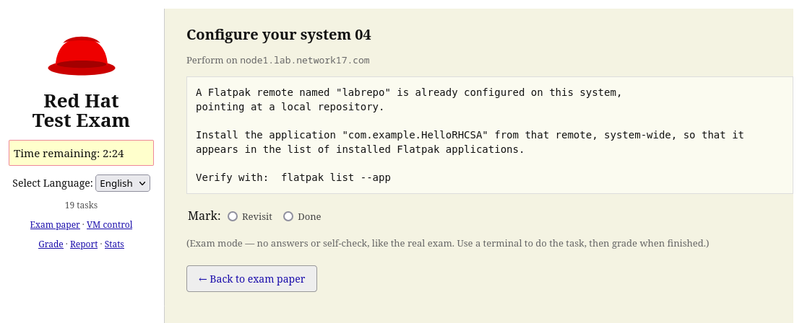
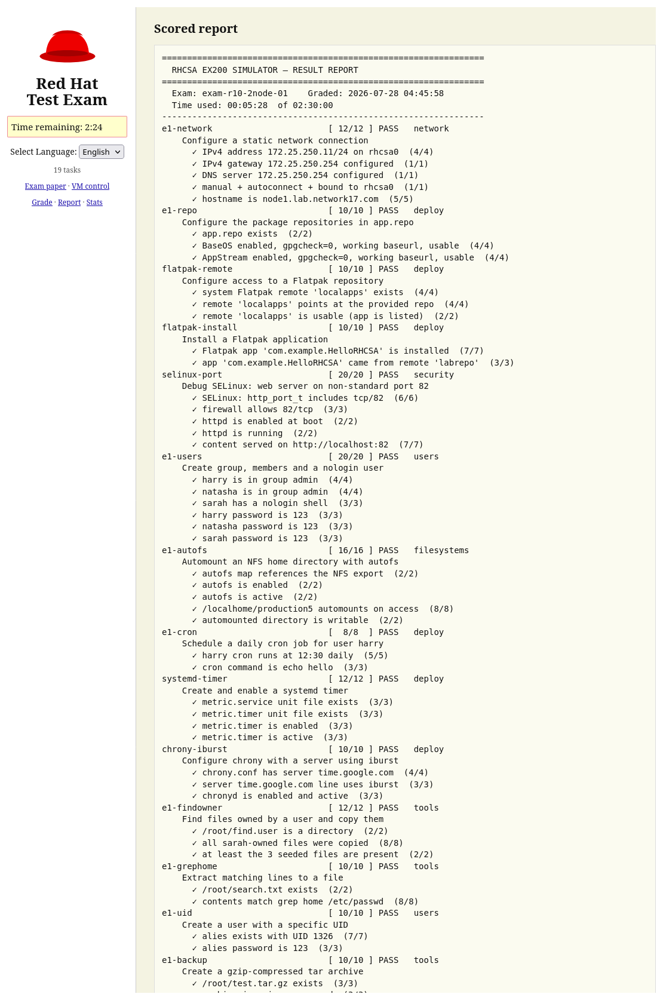

# RHCSA EX200 Exam Simulator

A self-contained simulator that reproduces the **Red Hat Certified System
Administrator (RHCSA / EX200)** exam: a timed task paper, real configuration work
on a live system, automated objective grading, and a scored, per-task report.

- **Works on RHEL 9 and RHEL 10 — detected automatically.** Install it on a
  RHEL 10 machine and you get the RHCSA 10 content set (Flatpak, systemd timer
  units, GPT-only partitioning; containers and set-GID collaboration dropped, per
  the RHEL 10 EX200 objectives). Install it on a RHEL 9 machine and you get the
  RHCSA 9 set. No flags, no choice to make — the exam follows the OS.
- **250+ task templates** across every RHCSA objective domain. Most randomize
  their values (users, sizes, ports, paths, packages…) on every run, so exams
  can't be memorized.
- **Single-node and two-node exams**, for both versions. A two-node exam pairs
  two VMs and grades both from one controller — like the real remote exam. Plus
  **category practice**, **mock** (aid-free rehearsal), and **drill** modes.
- **Objective grading** with a real persistence check (grade *after* a reboot),
  a scored per-task report, and per-task hints/solutions in practice mode.
- **Fully offline** — RPM packages *and* the RHCSA 10 Flatpak repo come from the
  attached RHEL install DVD; no internet or subscription needed.
- A faithful **browser "Test Exam" view** (paper, timer, task list, VM control)
  *and* a complete command-line interface.

> ⚠️ **Run only on a DISPOSABLE RHEL 9 or RHEL 10 (or Rocky / AlmaLinux /
> CentOS Stream 9|10) virtual machine.** The simulator creates users, partitions,
> logical volumes, services, and firewall/SELinux rules. **Take a VM snapshot
> before you start** — reverting it is the reliable way to reset.

## Screenshots

| Command menu | Exam paper (browser) |
|:---:|:---:|
|  |  |
| **Task detail — hint · solution · check** | **Category practice** |
|  |  |
| **VM control — manage node2 in two-node exams** | **Scored per-task report** |
|  |  |

### RHCSA 10 two-node exam

| Two-node paper (RHEL 10) | Flatpak task — new in RHCSA 10 |
|:---:|:---:|
|  |  |

**Combined report — Flatpak + systemd-timer graded on RHEL 10:**



## Install

On a disposable RHEL 9 **or RHEL 10** VM with the matching install DVD attached:

```bash
git clone https://github.com/ambawatyuvaraj/rhcsa-exam-simulator.git
cd rhcsa-exam-simulator
sudo ./install.sh        # detects the RHEL version, installs the 'rhcsa-sim' CLI + local DVD repo
```

`install.sh` prints which content set it detected (`RHCSA 9` or `RHCSA 10`);
`rhcsa-sim doctor` and `rhcsa-sim list` then show only what applies to that
release. (To develop/test the other version on one box: `RHCSA_RHEL=10 rhcsa-sim …`.)

## RHCSA 9 vs. RHCSA 10

Red Hat re-based the EX200 exam on RHEL 10. **The simulator matches whichever
RHEL version it runs on — you don't choose.** Put the simulator on a RHEL 10 VM
and every exam, practice category, and troubleshooting-gym scenario is drawn only
from the RHCSA 10 objectives; put it on RHEL 9 and you get the RHCSA 9 set exactly
as before. Nothing about the RHEL 9 experience changed.

What the **RHCSA 10** set does differently, straight from the RHEL 10 objectives:

| | RHCSA 9 | RHCSA 10 |
|---|---|---|
| **Flatpak** | — | **New.** Configure a Flatpak remote and install/remove Flatpak apps — fully offline, from a repo built off the RHEL 10 DVD (no internet, no subscription). |
| **Task scheduling** | cron, at | cron, at, **systemd timer units** |
| **Partitioning** | MBR + GPT | **GPT only** |
| **Containers (podman)** | included | **removed** — no longer an RHCSA objective |
| **Set-GID collaboration dirs** | included | **removed** |
| **Server-side services** (NFS/repo/NTP *servers*) | — | excluded (client-side only, as RHCSA intends) |
| Repos, packages, LVM, networking, firewalld, SELinux, users, storage, scripting | ✓ | ✓ (unchanged — RHEL 10 still ships DNF 4, `nmcli`, `firewall-cmd`, `tuned`, etc.) |

Both versions keep the full feature set: single-node and two-node exams, category
practice, mock, drill, the troubleshooting gym, offline DVD repo, and the browser
exam view. Grade after a reboot to prove your config persists — the RHCSA 10
Flatpak and timer tasks are verified to survive it.

## Usage

```bash
sudo rhcsa-sim doctor            # check the environment is ready
sudo rhcsa-sim start exam-01     # seed a 150-minute exam and start the timer
sudo rhcsa-sim tui               # open the browser exam paper (use --text for a terminal UI)
#   ... do the tasks on the live system ...
sudo rhcsa-sim grade --reboot    # grade after a reboot (persistence test), like the real exam
sudo rhcsa-sim report            # scored, per-task breakdown
sudo rhcsa-sim reset             # wipe all changes back to a clean state
```

More modes: `practice <category>` (drill one topic with hints), `mock <exam>`
(aid-free rehearsal), `list` (all exams and tasks).

## Single-node vs. two-node exams

| | Single-node (`exam-01`…`05`) | Two-node (`exam-2node-01`…`08`) |
|---|---|---|
| Machines | one VM | two paired VMs — **node1** + **node2** |
| Feels like | a focused drill | the real remote EX200 (two systems) |
| Grading | `rhcsa-sim grade` on the VM | run once on **node1**; it grades node2 over SSH and prints one combined score |
| Adds | — | cross-node tasks (key-based SSH, `rsync`), node2 root-password recovery, per-node task groups, the VM-control panel |

### Set up two nodes

Clone the VM (or build a second identical one), run `install.sh` on **both**, then pair them:

```bash
sudo rhcsa-sim node-setup --role node1 --peer <node2-ip>   # on node1
sudo rhcsa-sim node-setup --role node2 --peer <node1-ip>   # on node2
sudo rhcsa-sim doctor            # run on both — must be GREEN (controller channel OK)
```

> Full walkthrough (root-SSH trust, spare disk, DVD, grading, reset): **[SETUP.md](SETUP.md)**.

### Practice a two-node exam — all from node1

```bash
sudo rhcsa-sim list                  # RHEL 9 shows exam-2node-01…08; RHEL 10 shows exam-r10-2node-01…03
sudo rhcsa-sim start exam-2node-01   # (on RHEL 10: exam-r10-2node-01) — seeds BOTH nodes
sudo rhcsa-sim tui                   # paper shows both nodes' task groups + a VM panel for node2
#   do node1 tasks here; for node2:  ssh student@node2.example.com  then  sudo -i
sudo rhcsa-sim grade --reboot        # reboots + grades both, prints one combined /300 score
```

## Requirements

- A disposable **RHEL 9 or RHEL 10** VM (or Rocky / AlmaLinux / CentOS Stream
  9|10) — ~2 GB RAM, plus one blank spare disk for storage tasks.
- The matching **install DVD ISO** attached — the offline package source (and,
  on RHEL 10, the Flatpak source).
- Two-node exams need a second identical VM, paired with `rhcsa-sim node-setup`.
- The browser view needs `firefox` (optional — a terminal UI is built in).

## License

MIT — see [LICENSE](LICENSE).
